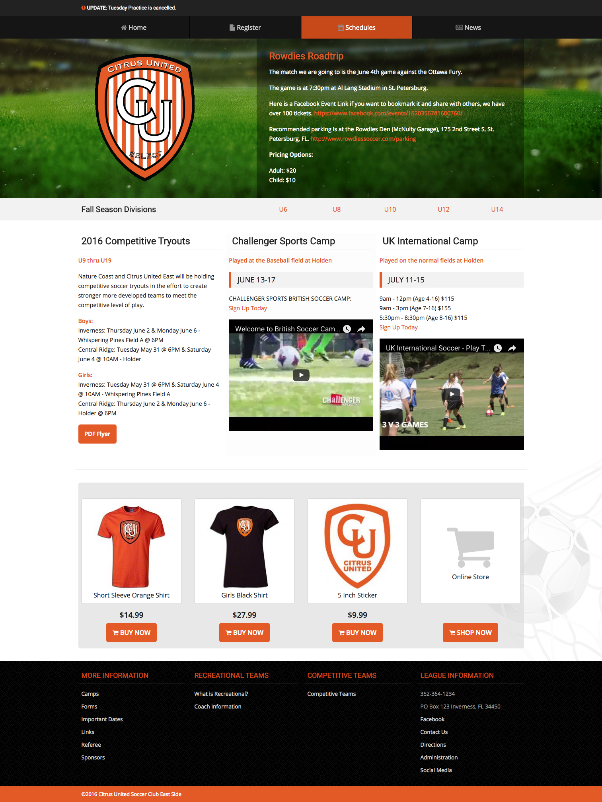

## MODX Theme Documentation

> DEMO: http://little-league.in.modxcloud.com/

### Free Features

1. Registration for League with Extended Fields
2. News Post Page
3. Division Scheduling
4. Easy theme adjustments
5. Alert Bar
6. Color Coded Team Rosters
7. Custom Store Advertisement Section
8. Dynamic Header and Footer Sections
9. Apparel Report based on Registration

### Manual Operations

1. Creation of "Team Rosters" and Divisions
2. Next Year Registration plan would be look up user and update `activeYear` and Apparel Sizes
3. Mark user `PAID`

### Features you can pay MODX for

1. Dynamic Schedules, not manual tables
2. Team Roster builder, not manual pages
3. Login portal so players can update their info each year.
4. Payment Integration into Registration
5. Full Blog Features

---

### Setup

#### Email Receiver

> System Settings > Mail - Change the address to receive system emails

#### Theme Configuration

> Extras > Configuration

Here you can change your League Info and some color options

#### Footer Links

The Footer Sections and Links are already setup in the Resource Tree. You can edit, create, and delete to dynamically add new items.

#### Registration

> Form Pages are under Resource 11

You can duplicate Resource 12 or update the YEAR and info

> Form Code is under Elements > Chunk "Division_Registration" (21)

 - The Age Calculation is in the main JS file.
 - the extended field `activeYear` is automatically set and used in generating current reports
 - User Activation is required.
 - All Activation pages and emails are created automatically.


#### Home page

> The home page is full of Template Variable options.

1. Manually enter the "Masthead" text or choose a page.
2. Breadcrumb banner for quick Division access
3. Show 3 latest News Posts
4. Show 4 Store Items



#### Division Schedules

> Start each year off new or edit each page.


1. Tell the "Schedules" Root Resource which Year to show.
2. Templates for "Schedule - Year" and "Schedule - Division" are basically placeholders.
3. Template "Schedule - Group" allows you to set "Rec" or "Competitive" and shows some more navigation items to users. - http://little-league.in.modxcloud.com/2016-u8-coed/
4. Team Resources can be input under the Group


The Group Game Schedules are easily created in a table. Just copy and paste this.

```
<h2>October</h2>
<table class="border highlight" cellspacing="0" cellpadding="0">
<thead>
<tr><th> </th><th>9AM</th><th>10AM</th><th>11AM</th><th>12PM</th><th>1PM</th><th>2PM</th></tr>
</thead>
<tbody>
<tr>
<td data-label="">Oct 9th</td>
<td data-label="9AM">10A vs 10B</td>
<td data-label="10AM">10C vs 10D</td>
<td data-label="11AM">10E vs 10F</td>
<td data-label="12PM">10G vs 10H</td>
<td data-label="1PM">10I vs 10J</td>
<td data-label="2PM">10J vs 10L</td>
</tr>
<tr>
<td data-label="">Oct 18th</td>
<td data-label="9AM">10A vs 10B</td>
<td data-label="10AM">10C vs 10D</td>
<td data-label="11AM">10E vs 10F</td>
<td data-label="12PM">10G vs 10H</td>
<td data-label="1PM">10I vs 10J</td>
<td data-label="2PM">10J vs 10L</td>
</tr>
<tr>
<td data-label="">Oct 29th</td>
<td data-label="9AM">10A vs 10B</td>
<td data-label="10AM">10C vs 10D</td>
<td data-label="11AM">10E vs 10F</td>
<td data-label="12PM">10G vs 10H</td>
<td data-label="1PM">10I vs 10J</td>
<td data-label="2PM">10J vs 10L</td>
</tr>
</tbody>
</table>
```

### Reports

> There are some basic reports like Apparel #'s and D.O.B. table

1. http://little-league.in.modxcloud.com/apparel-order.html
2. http://little-league.in.modxcloud.com/league-stats.html
