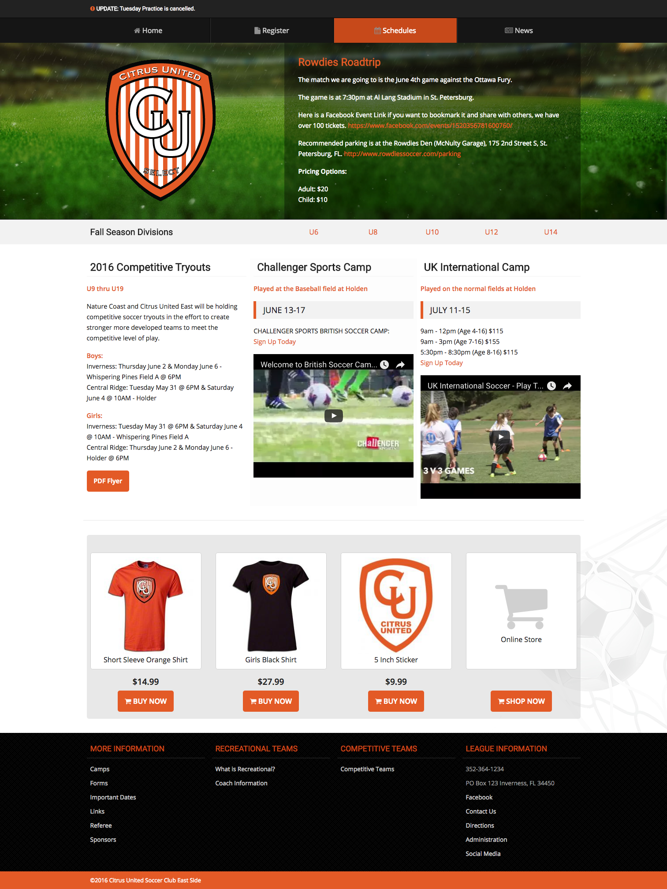

# Little League UI

### Getting Started

1. `npm install --save-dev gulp`

### Style Notes

> Nothing fancy, just an easy to use UI that should load lightning fast and get you the information you need

1. Very Little jQuery usage - basically just used to Toggle the Main Menu and the Footer Lists when below 768 pixels
2. The Primary color is set to Orange. Changing that variable in `theme.scss` will change it everywhere. Makes customization easier.
3. Logo is set for a badge style, horizontal logos probably will not work well.
4. All background images are styled inline so you don't have to hunt through CSS to change a background, and this makes CMS customization easier.
5. Main Menu is using Flex Box - expansion to 6 links or decreasing to 4 links will not require new CSS
6. Images included are just for mockup. Not licensed.
7. Fonts are set in the HEAD so you can easily change them and they load faster.
8. Registration Form has an Age calculator based on Birth Date entered.

---

--

### MODX Theme Documentation

[MODX.md](modx.md)
